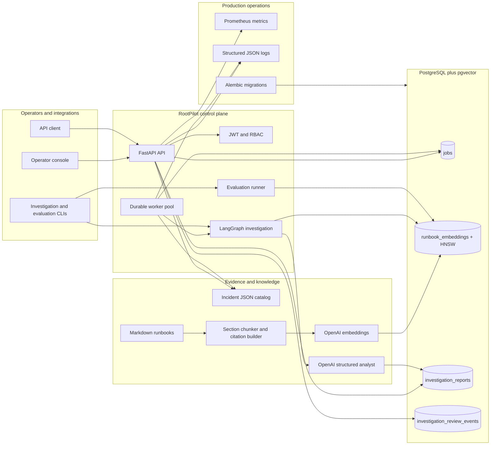

# RootPilot

RootPilot is a production-oriented, evidence-grounded incident investigation system. It validates incident evidence, retrieves the most relevant operational runbook sections from PostgreSQL/pgvector, generates a structured root-cause assessment with OpenAI, rejects unsupported citations, persists the result with complete provenance, and requires a human decision before an assessment is accepted.

The repository includes the API, durable worker, persistent vector index, review and audit workflow, evaluation suite, operator dashboard, container image, Docker Compose topology, Kubernetes manifests, database migrations, and CI/image-publishing workflows.

## Why RootPilot exists

During an incident, responders must correlate alerts, metrics, logs, deployments, and runbook knowledge under time pressure. An unconstrained chatbot can make this worse by producing a plausible but unsupported answer. RootPilot treats model output as a draft assessment inside a controlled evidence pipeline:

1. Incident data must pass strict Pydantic validation.
2. Only relevant runbook chunks are supplied to the analyst.
3. The analyst must return a typed `IncidentAssessment`.
4. The graph rejects an incident-ID mismatch or any citation that was not retrieved.
5. The report records the models, prompt version, retrieval settings, source hashes, scores, and citations used.
6. A human operator approves or rejects the report, and the decision is appended to an immutable audit history.

RootPilot never performs remediation against production infrastructure. Its output is a reviewable investigation artifact, not an autonomous change.

## Current capability status

| Capability | Status | Implementation |
|---|---|---|
| Structured incident ingestion | Complete | Strict nested JSON schemas; unknown fields rejected |
| Runbook chunking | Complete | Markdown split at `##` headings with stable citation IDs |
| Embeddings | Complete | Async OpenAI adapter behind an internal protocol |
| Development retrieval | Complete | Deterministic in-memory cosine search |
| Production retrieval | Complete | PostgreSQL `vector(1536)` storage and HNSW cosine index |
| Incremental indexing | Complete | Content/model hashes avoid re-embedding unchanged chunks |
| Investigation workflow | Complete | Typed LangGraph retrieve → analyze → validate graph |
| Grounding controls | Complete | Relevance floor, incident-ID check, retrieved-citation allowlist |
| Durable execution | Complete | PostgreSQL queue with row locks, leases, heartbeats, retries, and exhaustion handling |
| Report persistence | Complete | One structured report per job with retrieval/model provenance |
| Human review | Complete | One-time approve/reject transition with required rejection feedback |
| Audit history | Complete | Immutable review events |
| Authentication/RBAC | Complete | JWT bearer auth with viewer, operator, and admin roles |
| Observability | Complete | JSON logs, request IDs, latency/request Prometheus metrics, health/readiness |
| Operator interface | Complete | Responsive web console for queue, review, provenance, and audit history |
| Evaluation | Complete | Five labeled scenarios, retrieval/RCA metrics, configurable pass-rate gate |
| Database evolution | Complete | Alembic migrations with drift checking |
| Packaging/deployment | Complete | Non-root container, Compose stack, Kubernetes base manifests |
| CI/release | Complete | Backend/integration/frontend/container checks and GHCR publishing |

“Complete” here means the code and deployment artifacts are present and verified locally. A real production rollout still requires environment-owned values and infrastructure: a PostgreSQL endpoint, API credentials, a JWT issuer/secret, DNS/TLS, a container registry owner, and a Kubernetes or other runtime target.

## System architecture



### Runtime components

| Component | Entrypoint | Responsibility |
|---|---|---|
| Metadata API | `apps.metadata_service.main:app` | Catalog, job, report, review, audit, health, readiness, and metrics endpoints |
| Worker | `python -m apps.metadata_service.commands.run_worker` | Claims jobs, renews leases, runs investigations, retries transient failures, persists results |
| Retriever factory | `services/retriever_factory.py` | Selects in-memory or PostgreSQL retrieval from typed configuration |
| PostgreSQL retriever | `services/postgres_retriever.py` | Incremental runbook indexing and database-side cosine ranking |
| Investigation graph | `services/investigation_graph.py` | Evidence retrieval, relevance filtering, structured analysis, grounding validation |
| Execution coordinator | `services/investigation_execution.py` | Keeps model calls outside DB transactions and persists terminal state |
| Review service | `services/investigation_reports.py` | Locked state transitions and immutable audit-event creation |
| Operator console | `dashboard/` | Queue and monitor jobs, inspect reports/provenance, approve or reject assessments |

## End-to-end execution

```mermaid
sequenceDiagram
    actor Operator
    participant UI as Operator console
    participant API as FastAPI
    participant DB as PostgreSQL
    participant W as Worker
    participant V as pgvector
    participant O as OpenAI

    Operator->>UI: Select incident and queue investigation
    UI->>API: POST /jobs
    API->>DB: Insert pending job
    API-->>UI: Job record

    W->>DB: SELECT ... FOR UPDATE SKIP LOCKED
    W->>DB: Mark processing, increment attempt, set lease
    Note over W,DB: Short transaction closes
    loop While model work is active
        W->>DB: Renew owned lease
    end

    W->>O: Embed changed runbook chunks
    W->>V: Upsert vectors and source metadata
    W->>O: Embed incident query
    W->>V: Cosine top-K search
    V-->>W: Ranked runbook sections
    W->>O: Structured assessment request
    O-->>W: IncidentAssessment
    W->>W: Validate incident ID and citation allowlist

    alt Valid assessment
        W->>DB: Insert report + provenance; complete job
    else Transient OpenAI failure
        W->>DB: Requeue with bounded exponential delay
    else Permanent/validation failure
        W->>DB: Mark job failed with bounded error detail
    end

    UI->>API: GET pending report
    Operator->>UI: Approve or reject
    UI->>API: PATCH /investigation-reports/{id}/review
    API->>DB: Lock report, update once, append audit event
```

### Queue guarantees

The queue is intentionally implemented in PostgreSQL so job state and report state share one transactional system.

- `FOR UPDATE SKIP LOCKED` allows multiple worker replicas without double-claiming an available row.
- Every claim increments `attempt_count` and records `claimed_by` and `lease_expires_at`.
- A heartbeat extends the lease during long embedding or analysis requests.
- If heartbeat renewal fails, the in-flight operation is cancelled rather than continuing without ownership.
- An expired lease can be reclaimed while attempts remain.
- An expired lease at the maximum attempt count is converted to `failed`, so jobs cannot remain stuck forever.
- Transient OpenAI connection, timeout, internal-server, and rate-limit failures are requeued with bounded exponential delay.
- Other failures are terminal and retain a bounded diagnostic message.
- Model/network work never runs inside a long-lived database transaction.

Delivery is at least once. Report uniqueness (`job_id`) and active lease ownership provide the idempotency boundary for successful persistence.

## Retrieval and RAG design

### Chunking

A runbook starts with a heading such as:

```text
# RB-DB-001: Database Connection-Pool Exhaustion
```

Every level-two heading becomes one independently searchable chunk. `## Likely causes` becomes:

```text
RB-DB-001#likely-causes
```

This structure is deterministic, readable by operators, and precise enough for citation validation.

### Text construction

`build_incident_query()` serializes the incident title, service, summary, symptoms, metrics, logs, and recent changes into consistent embedding text. `build_runbook_search_text()` combines the runbook title, section title, and content. The original typed objects remain unchanged.

### Persistent indexing

For each section RootPilot stores:

- Citation ID, runbook ID/title, and section title
- Raw section content and source filename
- SHA-256 content hash
- Embedding model and dimension count
- A `vector(1536)` embedding
- Index timestamp

At worker/CLI startup, only sections whose content hash or embedding model changed are embedded. Stale citations are deleted. The HNSW index uses `vector_cosine_ops`; queries calculate cosine distance in PostgreSQL, convert it to a bounded similarity score, order deterministically, and return top K.

The in-memory retriever remains available for deterministic tests and small local experiments. Production configuration rejects it.

### Grounded generation

The analyst receives only the validated incident and retrieved sections. The prompt treats runbook text as reference material, not as instructions. The Responses API parses directly into `IncidentAssessment`, which requires:

- Exact incident ID
- Root cause
- Supporting evidence
- Recommended actions
- Verification steps
- Confidence from 0 to 1
- At least one stable citation ID

The graph then independently verifies that the incident ID matches and every returned citation was present in retrieved context. Unsupported output never reaches report persistence.

## Provenance and auditability

Each report stores the assessment plus:

- Embedding model
- Analysis model
- Prompt version
- Retrieval backend
- Top-K limit and minimum relevance score
- Every retrieved citation and similarity score
- SHA-256 hash and source file for every retrieved section
- Creation/update timestamps
- Review identity, feedback, and timestamp

Each review also creates a separate append-only event containing the prior status, new status, reviewer, feedback, and timestamp. A report can transition from `pending_review` only once.

## Database model

```mermaid
erDiagram
    JOBS ||--o| INVESTIGATION_REPORTS : produces
    INVESTIGATION_REPORTS ||--o{ INVESTIGATION_REVIEW_EVENTS : records

    JOBS {
        uuid id PK
        string incident_id
        string input_path
        enum status
        int attempt_count
        int max_attempts
        string claimed_by
        timestamptz lease_expires_at
        timestamptz scheduled_at
        text error_message
        timestamptz started_at
        timestamptz completed_at
    }

    INVESTIGATION_REPORTS {
        uuid id PK
        uuid job_id FK_UK
        string incident_id
        text root_cause
        jsonb supporting_evidence
        jsonb recommended_actions
        jsonb verification_steps
        float confidence
        jsonb citation_ids
        string embedding_model
        string analysis_model
        string prompt_version
        string retrieval_backend
        int retrieval_limit
        float minimum_relevance_score
        jsonb retrieved_sections
        enum status
    }

    INVESTIGATION_REVIEW_EVENTS {
        uuid id PK
        uuid report_id FK
        enum previous_status
        enum new_status
        string reviewed_by
        text reviewer_feedback
        timestamptz created_at
    }
```

`runbook_embeddings` is a separate knowledge index keyed by citation ID and protected by a fixed-dimension constraint plus HNSW, model, and runbook indexes.

## API

Development OpenAPI documentation is available at `/docs`. It can be disabled with `DOCS_ENABLED=false`.

| Method | Route | Minimum role | Purpose |
|---|---|---|---|
| `GET` | `/health` | Public | Process liveness |
| `GET` | `/ready` | Public | Database readiness |
| `GET` | `/metrics` | Public/internal | Prometheus exposition |
| `GET` | `/incidents` | Viewer | List prepared incident catalog |
| `POST` | `/jobs` | Operator | Queue a known incident |
| `GET` | `/jobs` | Viewer | List/filter jobs with pagination |
| `GET` | `/jobs/{id}` | Viewer | Get one job |
| `PATCH` | `/jobs/{id}/status` | Operator | Controlled lifecycle transition |
| `GET` | `/investigation-reports` | Viewer | List/filter reports with pagination |
| `GET` | `/investigation-reports/{id}` | Viewer | Get report and provenance |
| `GET` | `/investigation-reports/{id}/review-events` | Viewer | Get audit history |
| `PATCH` | `/investigation-reports/{id}/review` | Operator | Approve or reject once |

Roles are hierarchical: `admin` inherits operator and viewer permissions; `operator` inherits viewer permissions. When authentication is enabled, reviewer identity comes from the token subject rather than the request body.

Example job request:

```bash
curl -X POST http://localhost:8000/jobs \
  -H 'Content-Type: application/json' \
  -H 'Authorization: Bearer YOUR_TOKEN' \
  -d '{"incident_id":"INC-DB-001","max_attempts":3}'
```

## Security controls

- JWT signatures, expiry, optional issuer, and optional audience are validated.
- Tokens require a non-empty `sub` and at least one recognized role.
- Production startup fails when auth is disabled, PostgreSQL retrieval is not selected, the JWT secret is too short, or wildcard hosts are allowed.
- `TrustedHostMiddleware` rejects unexpected host headers.
- CORS is off unless explicit origins are configured.
- Responses add request ID, content-type, frame, and referrer security headers.
- Pydantic models forbid unrecognized evidence/provenance fields.
- The container runs as a non-root user; Kubernetes drops Linux capabilities, disables service-account token mounting, uses RuntimeDefault seccomp, and mounts the root filesystem read-only.
- Kubernetes includes ingress restrictions and a default-deny ingress policy.

JWT issuance belongs to the deploying identity system. RootPilot validates tokens; it does not provide a login or password database.

## Observability

Application logs are JSON objects containing UTC timestamp, level, logger, event message, and relevant request/job/incident context. Incoming `X-Request-ID` is preserved (bounded to 128 characters); otherwise RootPilot creates one and returns it in the response.

`/metrics` exports:

- `rootpilot_http_requests_total{method,route,status}`
- `rootpilot_http_request_duration_seconds{method,route}`
- `rootpilot_http_requests_in_progress{method}`

Use `/health` for liveness and `/ready` for traffic readiness. The Kubernetes probes follow that distinction.

## Repository layout

```text
apps/metadata_service/
  api/                 FastAPI incident, job, and report routes
  commands/            retrieval, investigation, evaluation, and worker CLIs
  models/              SQLAlchemy tables
  schemas/             Pydantic trust-boundary models
  services/            loaders, RAG, graph, queue, reports, evaluation
  config.py            typed environment configuration
  database.py          async engine and sessions
  observability.py     logs, request middleware, Prometheus
  security.py          JWT parsing and RBAC
dashboard/             operator web console
data/
  incidents/           five structured incident scenarios
  runbooks/            five operational runbooks / 25 chunks
  evaluations/         five retrieval and five RCA labels
deploy/kubernetes/     production Kubernetes base manifests
migrations/versions/   ordered Alembic history
tests/unit/            deterministic unit/API tests
tests/integration/     real PostgreSQL and pgvector tests
compose.yaml           local PostgreSQL, migration, API, worker topology
Dockerfile             non-root production API/worker image
```

## Local development

### Requirements

- Python 3.12+
- [uv](https://docs.astral.sh/uv/)
- Docker with Compose
- Node.js 22.13+ for the dashboard

### Install and migrate

```bash
uv sync --frozen
docker compose up -d postgres
uv run alembic upgrade head
uv run alembic current
uv run alembic check
```

Use the existing local environment file expected by the project. `.env.production.example` documents all production variables without being loaded automatically.

### Run API and worker from the host

```bash
uv run uvicorn apps.metadata_service.main:app --reload
uv run python -m apps.metadata_service.commands.run_worker
```

Run one worker iteration for diagnostics:

```bash
uv run python -m apps.metadata_service.commands.run_worker --once
```

### Run the complete Compose backend

```bash
docker compose up --build postgres migrate api worker
```

The API defaults to `http://localhost:8000`. Compose waits for PostgreSQL health, applies migrations once, then starts the API and worker.

### Run the operator console

```bash
cd dashboard
npm ci
npm run dev
```

Open `http://localhost:3000`, enter the API URL and, when auth is enabled, a bearer token. The token remains in React memory and is cleared when the tab closes; only the API base URL is stored locally.

## CLI workflows

Retrieve runbooks:

```bash
uv run python -m apps.metadata_service.commands.retrieve_runbooks INC-DB-001 --limit 3
```

Run an ephemeral grounded investigation:

```bash
uv run python -m apps.metadata_service.commands.investigate_incident INC-DB-001 --limit 3 --minimum-score 0.0
```

Persist against an existing pending job:

```bash
uv run python -m apps.metadata_service.commands.investigate_incident INC-DB-001 --job-id JOB_UUID
```

Run the quality gate:

```bash
uv run python -m apps.metadata_service.commands.evaluate_pipeline \
  --minimum-retrieval-pass-rate 1.0 \
  --minimum-assessment-pass-rate 1.0
```

The evaluation command prints machine-readable JSON and exits non-zero when either configured pass-rate threshold is missed.

## Configuration

| Variable | Default | Meaning |
|---|---:|---|
| `ENVIRONMENT` | `development` | `development`, `test`, or `production` |
| `LOG_LEVEL` | `INFO` | Root structured log level |
| `ALLOWED_HOSTS` | `["*"]` | Accepted host headers; wildcard forbidden in production |
| `CORS_ORIGINS` | `[]` | Explicit dashboard/browser origins |
| `DOCS_ENABLED` | `true` | Serve OpenAPI docs |
| `POSTGRES_*` | required | Database connection settings |
| `DATABASE_POOL_SIZE` | `10` | Persistent connection pool size |
| `DATABASE_MAX_OVERFLOW` | `20` | Extra burst connections |
| `DATABASE_POOL_TIMEOUT_SECONDS` | `30` | Pool checkout timeout |
| `DATABASE_POOL_RECYCLE_SECONDS` | `1800` | Connection recycling interval |
| `OPENAI_API_KEY` | required | OpenAI API credential |
| `OPENAI_EMBEDDING_MODEL` | `text-embedding-3-small` | Embedding model |
| `OPENAI_ANALYSIS_MODEL` | `gpt-5.6-sol` | Structured analysis model |
| `OPENAI_TIMEOUT_SECONDS` | `60` | SDK request timeout |
| `OPENAI_MAX_RETRIES` | `2` | SDK-managed retries |
| `AUTH_ENABLED` | `false` | Enable JWT enforcement; required in production |
| `AUTH_JWT_SECRET` | unset | HS256 validation secret, minimum 32 chars |
| `AUTH_JWT_ISSUER` | unset | Optional required issuer |
| `AUTH_JWT_AUDIENCE` | unset | Optional required audience |
| `RETRIEVAL_BACKEND` | `memory` | `memory` or `postgres`; PostgreSQL required in production |
| `EMBEDDING_DIMENSIONS` | `1536` | Must match the vector migration/model |
| `DEFAULT_RETRIEVAL_LIMIT` | `3` | Worker top-K |
| `DEFAULT_MINIMUM_RELEVANCE_SCORE` | `0.0` | Worker relevance floor |
| `WORKER_POLL_INTERVAL_SECONDS` | `2` | Empty-queue polling interval |
| `WORKER_LEASE_SECONDS` | `300` | Claim lease duration |
| `WORKER_MAX_ATTEMPTS` | `3` | Default bounded attempts |

In tests, `ENVIRONMENT=test` selects `NullPool` so async PostgreSQL connections do not leak across isolated test event loops.

## Testing and quality

Run deterministic tests:

```bash
uv run pytest -v tests/unit
```

Run integration tests against a migrated dedicated test database:

```bash
RUN_POSTGRES_INTEGRATION=1 uv run pytest -v tests/integration
```

Run everything and validate migrations:

```bash
uv run alembic upgrade head
uv run alembic check
uv run pytest
git diff --check
```

Dashboard checks:

```bash
cd dashboard
npm audit --omit=dev --audit-level=high
npm run lint
npm test
```

The test suite covers validation, loaders, chunking, embeddings, cosine ranking, pgvector indexing/querying, LangGraph routing and citation rejection, queue leases/retries, report provenance, review locking/auditing, JWT roles, API contracts, metrics/security headers, migrations, and the rendered dashboard.

## Production deployment

### Container

```bash
docker build -t rootpilot:local .
docker run --rm --env-file .env.production -p 8000:8000 rootpilot:local
```

The same image runs migrations (`alembic upgrade head`), the API (default command), or the worker (override command).

### Kubernetes

1. Replace `ghcr.io/OWNER/rootpilot:latest` with the published image.
2. Update hosts, origins, PostgreSQL host, issuer, and audience in `deploy/kubernetes/configmap.yaml`.
3. Create `rootpilot-secrets` from your secret manager or from the keys shown in `secret.template.yaml`; do not apply the template values.
4. Apply the namespace/config, run the migration job, then deploy API/worker resources.

```bash
kubectl apply -f deploy/kubernetes/namespace.yaml
kubectl apply -f deploy/kubernetes/configmap.yaml
kubectl create secret generic rootpilot-secrets --namespace rootpilot \
  --from-literal=POSTGRES_PASSWORD='...' \
  --from-literal=OPENAI_API_KEY='...' \
  --from-literal=AUTH_JWT_SECRET='...'
kubectl apply -f deploy/kubernetes/migration-job.yaml
kubectl wait --for=condition=complete job/rootpilot-migrate -n rootpilot --timeout=300s
kubectl apply -f deploy/kubernetes/api.yaml
kubectl apply -f deploy/kubernetes/worker.yaml
kubectl apply -f deploy/kubernetes/ingress.yaml
kubectl apply -f deploy/kubernetes/policies.yaml
```

The base assumes a managed PostgreSQL service with the pgvector extension available and an ingress controller/TLS secret supplied by the target platform.

### CI and releases

`.github/workflows/ci.yml` starts pgvector PostgreSQL, installs from lockfiles, applies migrations, checks drift, runs unit and integration tests, verifies whitespace, builds the production image, audits dashboard production dependencies, lints, and renders/tests the dashboard.

`.github/workflows/publish-image.yml` publishes branch, semantic-version, and commit-SHA tags to GHCR with BuildKit cache, provenance, and an SBOM.

## Evaluation scenarios

The built-in labeled corpus covers:

- PostgreSQL application connection-pool exhaustion
- Kafka poison events and incompatible schemas
- Redis hot keys and connection saturation
- TLS certificate expiration
- Worker memory leaks and Kubernetes OOM restarts

Retrieval evaluation calculates recall@K, reciprocal rank, and pass rate. Assessment evaluation checks exact incident identity, citation grounding, expected citation recall, required root-cause/action terminology, confidence threshold, and graph rejection errors.

These synthetic cases are regression protection, not a substitute for organization-specific historical incidents. Before rollout, add representative internal incidents/runbooks and calibrate relevance and confidence thresholds against them.

## Operational invariants

The following rules are deliberate and should remain true as the project evolves:

1. Unvalidated incident evidence never enters retrieval.
2. Stable citation IDs are produced by the loader, not invented by the model.
3. Production vectors are durable and queried in PostgreSQL.
4. No OpenAI/network request occurs while a row lock or long DB transaction is held.
5. A worker must maintain lease ownership while doing work.
6. Retry counts are bounded and exhausted jobs become terminal.
7. A persisted report must have passed graph validation.
8. Every cited section must have been retrieved for that run.
9. Model, prompt, retrieval, score, source, and content-hash provenance is retained.
10. Human review is explicit, one-time, attributable, and auditable.
11. Production startup fails closed when required security/topology settings are missing.
12. External rollout values are supplied by the deployment environment, never hard-coded into application code.
