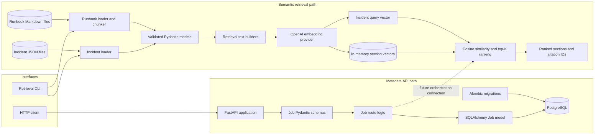
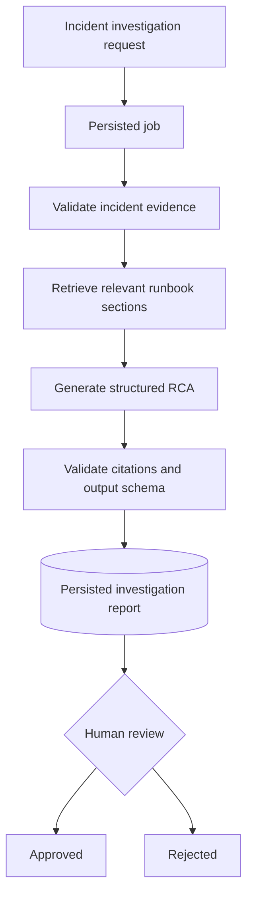
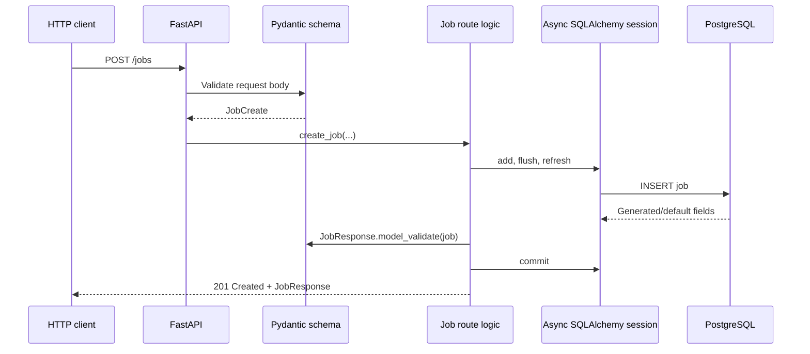
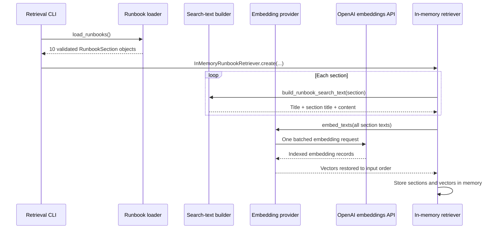
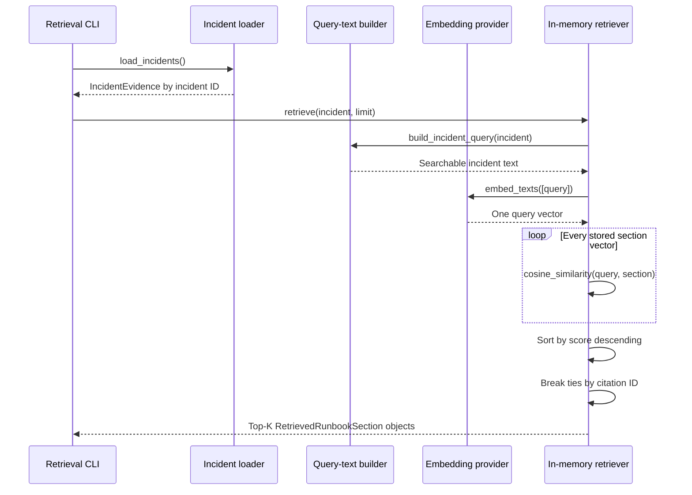
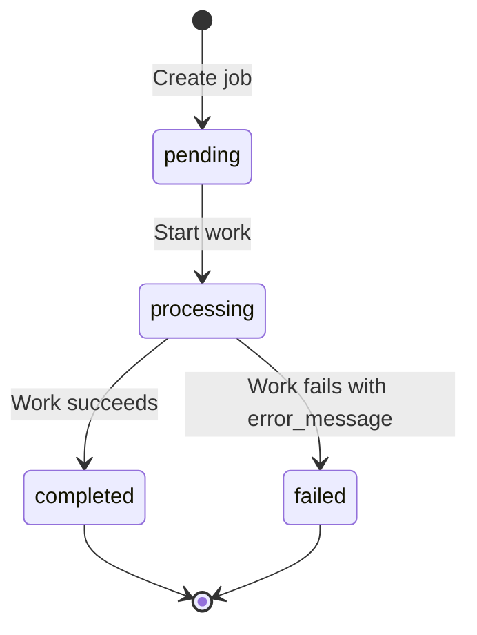

# RootPilot

RootPilot is an in-progress, evidence-grounded incident investigation backend. It is being built to turn structured production evidence—symptoms, metrics, logs, and recent changes—into a reviewable root-cause analysis supported by operational runbook citations.

The project currently implements the foundation of that workflow:

- A FastAPI metadata service and PostgreSQL-backed job lifecycle
- Strictly validated incident evidence loaded from JSON
- Markdown runbook loading and deterministic section-level chunking
- OpenAI embeddings behind a replaceable provider interface
- In-memory semantic retrieval using cosine similarity
- Stable citation identifiers for every retrieved runbook section
- A deterministic unit-test suite that does not call live OpenAI or PostgreSQL services

RootPilot does **not yet generate a root-cause analysis**. LangGraph orchestration, LLM-based analysis, persisted investigation reports, and human approval are the next stages. This README separates implemented behavior from planned behavior so that it can be used as an accurate learning guide.

## Table of contents

- [What RootPilot is trying to solve](#what-rootpilot-is-trying-to-solve)
- [Current project status](#current-project-status)
- [Technology stack](#technology-stack)
- [Core concepts](#core-concepts)
- [Architecture overview](#architecture-overview)
- [Detailed component architecture](#detailed-component-architecture)
- [Current execution flows](#current-execution-flows)
- [Data contracts](#data-contracts)
- [Runbook chunking and citations](#runbook-chunking-and-citations)
- [Semantic retrieval in detail](#semantic-retrieval-in-detail)
- [Job lifecycle and API](#job-lifecycle-and-api)
- [Repository structure](#repository-structure)
- [Local setup](#local-setup)
- [Running the application](#running-the-application)
- [Running semantic retrieval](#running-semantic-retrieval)
- [Troubleshooting](#troubleshooting)
- [Testing strategy](#testing-strategy)
- [Important design decisions](#important-design-decisions)
- [Known limitations](#known-limitations)
- [Roadmap](#roadmap)
- [Suggested learning path](#suggested-learning-path)
- [Architecture invariants](#architecture-invariants)
- [Glossary](#glossary)

## What RootPilot is trying to solve

Production incidents produce a large amount of fragmented evidence:

- Alerts describe symptoms but not causes.
- Metrics show that something changed but rarely explain why.
- Logs contain useful clues mixed with noise.
- Recent deployments may be related or coincidental.
- Runbooks contain operational knowledge, but responders must find the relevant section quickly.

RootPilot’s intended workflow is:

1. Receive a structured incident containing observable evidence.
2. Validate that evidence before it enters the investigation pipeline.
3. Search operational runbooks for the most relevant sections.
4. Give the incident and retrieved evidence to a controlled investigation graph.
5. Generate a structured root-cause assessment containing citations.
6. Persist that assessment as pending human review.
7. Allow an operator to approve or reject the assessment.

The goal is not to let an AI system make unreviewed production changes. The goal is to reduce investigation time while keeping the result grounded, traceable, and reviewable.

## Current project status

The following table describes the repository as it exists today.

| Capability | Status | Notes |
|---|---|---|
| FastAPI service | Implemented | Health, readiness, and job endpoints exist. |
| PostgreSQL integration | Implemented | Async SQLAlchemy, asyncpg, Docker Compose, and Alembic are configured. |
| Job lifecycle | Implemented | Supports `pending → processing → completed/failed`. |
| Incident evidence models | Implemented | Pydantic validates nested JSON evidence and rejects unknown fields. |
| Incident fixtures and loader | Implemented | Two prepared incident scenarios are included. |
| Runbook loader | Implemented | Markdown is split structurally at level-two headings. |
| Stable citations | Implemented | Every runbook section receives a deterministic citation ID. |
| Embedding abstraction | Implemented | Retrieval depends on an `EmbeddingProvider` protocol. |
| OpenAI embedding adapter | Implemented | Uses the asynchronous OpenAI embeddings API. |
| Similarity search | Implemented | Brute-force, in-memory cosine similarity with top-K ranking. |
| Vector database | Not implemented | Vectors are not persisted and no ANN index is used. |
| LangGraph investigation | Not implemented | This is the next major development milestone. |
| LLM root-cause generation | Not implemented | The project currently retrieves evidence only. |
| Persisted investigation report | Not implemented | The `jobs` table stores lifecycle metadata, not RCA output. |
| Human approval/rejection | Not implemented | Planned after report persistence. |
| RAG and LLM evaluation | Not implemented | Deterministic retrieval unit tests exist, but no evaluation suite yet. |
| End-to-end integration tests | Not implemented | Current API database tests use fake sessions. |
| Authentication and authorization | Deferred | Outside the reduced MVP. |
| Worker queue and Redis | Deferred | Outside the reduced MVP. |
| User interface | Deferred | The current interfaces are HTTP and CLI. |

### What “RAG” means for the current repository

RAG stands for **retrieval-augmented generation**. It has two major halves:

1. **Retrieval:** find relevant source material.
2. **Generation:** ask a model to create an answer grounded in that material.

RootPilot currently implements the retrieval half. It can transform an incident into an embedding, rank runbook chunks, and return citations. It does not yet send those chunks to an LLM to generate the final analysis, so describing the current system as a complete RAG pipeline would be inaccurate.

## Technology stack

| Technology | Role in RootPilot |
|---|---|
| Python 3.12+ | Application language and type system. |
| FastAPI | Async HTTP API, request validation integration, and OpenAPI documentation. |
| Pydantic | Runtime validation and serialization of jobs, incidents, runbook chunks, and retrieval results. |
| pydantic-settings | Typed loading of PostgreSQL and OpenAI configuration. |
| SQLAlchemy 2 | Async object-relational mapping and transaction handling. |
| asyncpg | Async PostgreSQL driver used by SQLAlchemy. |
| PostgreSQL 18 | Durable job metadata and lifecycle storage. |
| Alembic | Version-controlled database schema migrations. |
| OpenAI Python SDK | Asynchronous access to the embeddings API. |
| `text-embedding-3-small` | Default model used to vectorize incident and runbook text. |
| pytest | Unit-test framework. |
| AnyIO pytest plugin | Executes async tests using the asyncio backend. |
| uv | Python version, virtual environment, dependency, lockfile, and command management. |
| Docker Compose | Runs PostgreSQL for local development. |

LangGraph is part of the planned architecture but is not currently a dependency.

## Core concepts

### Incident evidence

An incident is represented as structured JSON instead of an unstructured prompt. It contains:

- Identity: incident ID, title, service, and start time
- A concise summary
- Human-readable symptoms
- Named metrics with numeric values and units
- Timestamped log records
- Timestamped recent changes

This structure lets validation happen before retrieval or analysis begins.

### Runbook

A runbook is an operational Markdown document describing signals, diagnosis steps, likely causes, remediation, and verification procedures for a known class of incident.

### Chunk

Embedding an entire long runbook as one document makes retrieval imprecise. RootPilot therefore divides each runbook into meaningful sections. Each `##` section becomes one chunk.

### Citation

A citation is a stable identifier pointing to one runbook section, for example:

```text
RB-DB-001#diagnosis
```

The part before `#` identifies the runbook. The slug after `#` identifies the section. Future RCA output will use these IDs to show which operational source supports a claim.

### Embedding

An embedding is a list of floating-point numbers representing the semantic meaning of a piece of text. Texts with related meanings usually receive vectors that point in similar directions.

### Cosine similarity

Cosine similarity measures the angle between two vectors. RootPilot uses it to compare the incident embedding with each runbook-section embedding.

### Job

A job is a persisted lifecycle record. It tracks an input path, current status, error information, and timestamps. At this stage, jobs and semantic retrieval are separate foundations; a job does not yet execute an investigation.

## Architecture overview

There are currently two implemented runtime paths:

1. The **metadata API path**, which stores and updates jobs in PostgreSQL.
2. The **semantic retrieval path**, which loads incidents and runbooks from files and ranks runbook sections.

They are intentionally shown separately because they have not yet been connected by an investigation worker or LangGraph workflow.



### Target architecture

The planned reduced MVP will connect these foundations through a small investigation graph:



The nodes after retrieval are roadmap items, not current functionality.

## Detailed component architecture

### 1. Interface layer

| Component | Location | Responsibility |
|---|---|---|
| FastAPI application | `apps/metadata_service/main.py` | Creates the HTTP application, registers routes, and exposes health/readiness checks. |
| Job router | `apps/metadata_service/api/jobs.py` | Creates jobs, retrieves jobs, and enforces job status transitions. |
| Retrieval command | `apps/metadata_service/commands/retrieve_runbooks.py` | Wires configuration, loaders, OpenAI embeddings, and the retriever into a runnable CLI. |

The interface layer performs wiring and transport work. Retrieval mathematics and file parsing remain in service modules so they can be tested independently.

### 2. Schema and validation layer

| Component | Location | Responsibility |
|---|---|---|
| Job schemas | `schemas/job.py` | Validate API requests and serialize ORM jobs. |
| Incident schemas | `schemas/incident.py` | Validate incident identity and nested evidence. |
| Runbook schema | `schemas/runbook.py` | Represent one independently retrievable runbook section. |
| Retrieval schema | `schemas/retrieval.py` | Pair a section with a bounded similarity score. |

Pydantic models form trust boundaries. Invalid or unexpected data should fail near ingestion instead of failing later inside retrieval or model prompting.

### 3. Loader and transformation layer

| Component | Location | Responsibility |
|---|---|---|
| Incident loader | `services/incident_loader.py` | Read JSON, parse it, validate it, detect duplicate incident IDs, and return typed models. |
| Runbook loader | `services/runbook_loader.py` | Parse Markdown headings, create section chunks, generate citations, and detect malformed runbooks. |
| Retrieval text builder | `services/retrieval_text.py` | Convert typed incidents and runbook sections into consistent embedding input. |

The original models are kept separate from the text sent for embedding. This makes retrieval formatting explicit and independently testable.

### 4. Embedding and retrieval layer

| Component | Location | Responsibility |
|---|---|---|
| `EmbeddingProvider` | `services/embedding.py` | Defines the asynchronous interface needed by retrieval. |
| `OpenAIEmbeddingProvider` | `services/openai_embedding.py` | Adapts the OpenAI embeddings API to the internal interface. |
| `InMemoryRunbookRetriever` | `services/retriever.py` | Builds section vectors, embeds incident queries, calculates similarity, sorts results, and returns top-K sections. |

The retriever depends on the protocol, not directly on the OpenAI implementation. Tests can therefore inject a deterministic fake embedding provider and avoid network calls, API charges, rate limits, and nondeterminism.

### 5. Persistence layer

| Component | Location | Responsibility |
|---|---|---|
| SQLAlchemy base | `models/base.py` | Defines shared metadata and deterministic database constraint names. |
| Job model | `models/job.py` | Maps the job lifecycle record to the `jobs` table. |
| Database module | `database.py` | Builds the async database URL, engine, session factory, and FastAPI session dependency. |
| Alembic environment | `migrations/env.py` | Runs online or offline migrations using application metadata. |
| Initial migration | `migrations/versions/` | Creates the job enum, table, primary key, and status index. |

### 6. Configuration layer

`apps/metadata_service/config.py` uses `pydantic-settings` to load configuration from environment variables and `.env`. `SecretStr` prevents the API key from being casually displayed when a settings object is printed. It is display protection, not encryption or a secrets manager.

`get_settings()`, the database URL, engine, and session factory are cached. They are application-wide objects that should not be recreated on every request.

### 7. Test layer

The tests are deliberately isolated:

- API tests replace the real database dependency with a fake asynchronous session.
- Embedding tests replace the OpenAI client with an async mock.
- Retriever tests inject a deterministic keyword-based embedding provider.
- Loader tests use prepared fixtures and temporary malformed files.

This allows the complete unit suite to run without PostgreSQL connectivity or OpenAI credits.

## Current execution flows

### Metadata-service request flow



If a SQLAlchemy operation fails, the route rolls back the transaction and returns a controlled HTTP 500 response.

### Readiness flow

`GET /ready` obtains an async database session and executes `SELECT 1`.

- Success returns HTTP 200 with `database: connected`.
- `OSError` or `SQLAlchemyError` returns HTTP 503.

`GET /health` does not contact PostgreSQL. It only confirms that the web process can answer requests.

### Runbook indexing flow

“Indexing” currently means constructing an in-memory list of embeddings. Nothing is written to PostgreSQL or a vector database.



### Incident retrieval flow



## Data contracts

### Incident evidence

All incident-related models inherit from `EvidenceModel`, which sets:

```python
model_config = ConfigDict(extra="forbid")
```

This means an incident containing an unexpected key is rejected rather than silently accepted. It catches spelling mistakes and protects the downstream pipeline from an ambiguous schema.

#### `IncidentEvidence`

| Field | Type | Validation or meaning |
|---|---|---|
| `incident_id` | `str` | Must follow `INC-<CATEGORY>-<3 digits>`, such as `INC-DB-001`. |
| `title` | `str` | Non-empty incident title. |
| `service` | `str` | Non-empty affected-service name. |
| `started_at` | `datetime` | Parsed from an ISO 8601 timestamp. |
| `summary` | `str` | Non-empty situation summary. |
| `symptoms` | `list[str]` | At least one symptom. |
| `metrics` | `list[IncidentMetric]` | At least one numeric measurement. |
| `logs` | `list[IncidentLog]` | At least one timestamped log record. |
| `recent_changes` | `list[IncidentChange]` | Required list; it may be empty. |

Nested evidence types:

- `IncidentMetric`: name, numeric value, and unit
- `IncidentLog`: timestamp, level, and message
- `IncidentChange`: timestamp and description

### Runbook section

Each parsed Markdown section becomes a `RunbookSection`:

| Field | Meaning |
|---|---|
| `runbook_id` | Stable ID parsed from the top-level heading. |
| `runbook_title` | Human-readable title from the top-level heading. |
| `section_title` | Text from the `##` heading. |
| `citation_id` | Stable `<runbook-id>#<section-slug>` reference. |
| `content` | Markdown content underneath that section heading. |
| `source_file` | Original Markdown filename. |

### Retrieval result

`RetrievedRunbookSection` contains:

- `section`: the complete `RunbookSection`
- `score`: cosine similarity constrained to the range `[-1.0, 1.0]`

### Job record

| Field | Database type/behavior | Meaning |
|---|---|---|
| `id` | UUID primary key | Stable job identifier. |
| `input_path` | `VARCHAR(1024)` | Reference to the input artifact; currently stored but not processed. |
| `status` | PostgreSQL enum, indexed | `pending`, `processing`, `completed`, or `failed`. |
| `error_message` | Nullable text | Required by API validation only for a transition to `failed`. |
| `started_at` | Nullable timezone-aware datetime | Set when processing begins. |
| `completed_at` | Nullable timezone-aware datetime | Set on completion or failure. |
| `created_at` | Server-default timestamp | Creation time. |
| `updated_at` | Server default with SQLAlchemy `onupdate` | Updated automatically for ORM-managed updates; no database trigger currently exists. |

## Runbook chunking and citations

### Required Markdown format

A runbook must begin with exactly this kind of top-level heading:

```markdown
# RB-DB-001: Database Connection-Pool Exhaustion
```

Its chunks are defined by level-two headings:

```markdown
## Signals

Content describing observable signals.

## Diagnosis

Content describing diagnostic steps.
```

The loader rejects:

- Empty files
- Invalid top-level headings
- Runbooks with no `##` sections
- Empty sections
- Duplicate citation IDs within one runbook
- Duplicate runbook IDs across files in the loaded directory

### Why structural chunking is used

The current runbooks are intentionally organized by operational purpose. Splitting on `##` headings preserves that meaning:

- A “Signals” result tells the investigator why the runbook matched.
- A “Diagnosis” result supplies confirmation steps.
- A “Remediation” result supplies recovery actions.
- A “Verification” result supplies success criteria.

Fixed-size token windows would be useful for large, irregular documents, but they could split a procedure in the middle. Structural chunks are simpler and more interpretable for the current curated corpus.

### Citation generation

The loader lowercases a section title, replaces non-alphanumeric sequences with hyphens, and removes leading/trailing hyphens.

Examples:

| Runbook ID | Section heading | Citation ID |
|---|---|---|
| `RB-DB-001` | `Signals` | `RB-DB-001#signals` |
| `RB-DB-001` | `Likely causes` | `RB-DB-001#likely-causes` |
| `RB-KAFKA-001` | `Verification` | `RB-KAFKA-001#verification` |

The ID is deterministic: the same runbook ID and heading produce the same citation every time. It is not immutable—renaming a section heading changes its generated citation ID.

### Included corpus

The repository currently contains two runbooks, each with five sections:

- `RB-DB-001`: database connection-pool exhaustion
- `RB-KAFKA-001`: Kafka consumer lag and poison events

Together they produce ten retrievable chunks.

## Semantic retrieval in detail

### Step 1: Build searchable text

Raw objects are converted into deliberate text representations before embedding.

For an incident, `build_incident_query()` includes:

- Title
- Service
- Summary
- Symptoms
- Metric names, values, and units
- Log levels and messages
- Recent-change descriptions when present

For a runbook chunk, `build_runbook_search_text()` includes:

- Runbook title
- Section title
- Section content

Metadata such as the source filename and citation ID is kept on the object but is not currently embedded.

### Step 2: Generate embeddings

The internal contract is intentionally small:

```python
class EmbeddingProvider(Protocol):
    async def embed_texts(
        self,
        texts: list[str],
    ) -> list[list[float]]:
        ...
```

Any object with this asynchronous method can be used by the retriever. `OpenAIEmbeddingProvider` is the live OpenAI adapter currently included.

It sends:

```python
await client.embeddings.create(
    model=model_name,
    input=texts,
    encoding_format="float",
)
```

The adapter sorts returned records by their `index` and verifies that every expected index exists. This protects the association between input text and output vector.

### Step 3: Build the in-memory index

`InMemoryRunbookRetriever.create()`:

1. Requires at least one section.
2. Builds embedding text for every section.
3. Embeds the section texts as one batch.
4. Verifies that the provider returned exactly one vector per section.
5. Stores the section list and parallel vector list on the retriever object.

This is called an in-memory index for convenience, but it is a simple list rather than a specialized nearest-neighbor data structure.

### Step 4: Embed the incident query

`retrieve()` builds one incident query and requests exactly one query embedding. It rejects a provider response containing zero or multiple query embeddings.

### Step 5: Calculate cosine similarity

For query vector `q` and runbook vector `r`, cosine similarity is:

```text
cosine_similarity(q, r) = dot(q, r) / (length(q) × length(r))
```

Expanded:

```text
dot(q, r) = q₁r₁ + q₂r₂ + ... + qₙrₙ

length(q) = √(q₁² + q₂² + ... + qₙ²)
```

Interpretation:

- Near `1.0`: vectors point in very similar directions.
- Near `0.0`: vectors are largely unrelated in direction.
- Near `-1.0`: vectors point in opposite directions.

The function rejects empty vectors, vectors with different dimensions, and zero-length vectors. A calculated score is clamped to `[-1.0, 1.0]` to remove tiny floating-point overshoots.

### Step 6: Rank and select top-K

Every section is scored. Results are ordered by:

1. Similarity score descending
2. Citation ID ascending as a deterministic tie-breaker

The first `limit` results are returned. The default limit is three.

Conceptually:

```python
for section_vector in all_section_vectors:
    score = cosine_similarity(query_vector, section_vector)
    results.append((section, score))

results.sort(by="highest score, then citation ID")
return results[:limit]
```

### Complexity

For `N` chunks with embedding dimension `D`, one retrieval performs approximately `O(N × D)` similarity work and stores `O(N × D)` floating-point values.

This is appropriate for ten chunks. As the corpus grows, persistent vector storage becomes valuable. Sufficiently large or latency-sensitive collections may also benefit from an approximate-nearest-neighbor index, such as PostgreSQL with `pgvector` or a dedicated vector database.

### What is and is not stored

Currently stored in PostgreSQL:

- Job metadata and lifecycle timestamps

Currently stored only in process memory:

- Runbook-section embeddings
- Incident query embedding
- Ranked retrieval results

Currently stored as repository files:

- Incident fixtures
- Runbook Markdown files

Because vectors are not persisted, starting the CLI again embeds all ten runbook chunks again before embedding the incident query.

## Job lifecycle and API

### State machine



No other transitions are allowed. For example:

- `pending → completed` is rejected.
- `completed → processing` is rejected.
- `failed → processing` is rejected.

Status updates retrieve the row using `SELECT ... FOR UPDATE` semantics through `with_for_update=True`. With PostgreSQL, this serializes concurrent updates to the same job row so that two requests cannot both apply transitions based on the same stale status.

The unit suite verifies that route code requests `with_for_update=True`. Actual concurrent behavior still needs to be proven by a PostgreSQL integration test.

### Endpoints

| Method | Path | Typical responses | Purpose |
|---|---|---|---|
| `GET` | `/health` | `200` | Process-level liveness check. |
| `GET` | `/ready` | `200` or `503` | Database readiness check. |
| `POST` | `/jobs` | `201` | Create a pending job. |
| `GET` | `/jobs/{job_id}` | `200` or `404` | Retrieve one job. |
| `PATCH` | `/jobs/{job_id}/status` | `200`, `404`, or `409` | Apply an allowed lifecycle transition. |

### Create a job

```bash
curl -X POST http://127.0.0.1:8000/jobs \
  -H 'Content-Type: application/json' \
  -d '{"input_path":"data/incidents/database_pool_exhaustion.json"}'
```

Example response shape:

```json
{
  "id": "5fa77a07-7d39-414f-a6f1-0b3a54d21e86",
  "input_path": "data/incidents/database_pool_exhaustion.json",
  "status": "pending",
  "error_message": null,
  "started_at": null,
  "completed_at": null,
  "created_at": "2026-08-15T12:00:00Z",
  "updated_at": "2026-08-15T12:00:00Z"
}
```

The UUID and timestamps are examples; actual values are generated at runtime.

### Retrieve a job

```bash
curl http://127.0.0.1:8000/jobs/<job-id>
```

### Start processing

```bash
curl -X PATCH http://127.0.0.1:8000/jobs/<job-id>/status \
  -H 'Content-Type: application/json' \
  -d '{"status":"processing"}'
```

### Mark a job completed

```bash
curl -X PATCH http://127.0.0.1:8000/jobs/<job-id>/status \
  -H 'Content-Type: application/json' \
  -d '{"status":"completed"}'
```

### Mark a job failed

```bash
curl -X PATCH http://127.0.0.1:8000/jobs/<job-id>/status \
  -H 'Content-Type: application/json' \
  -d '{
    "status":"failed",
    "error_message":"Investigation failed"
  }'
```

An error message is required for `failed` and forbidden for every other requested status.

## Repository structure

```text
rootpilot/
├── apps/
│   └── metadata_service/
│       ├── api/
│       │   └── jobs.py                 # Job HTTP endpoints and transitions
│       ├── commands/
│       │   └── retrieve_runbooks.py    # Live semantic-retrieval CLI
│       ├── models/
│       │   ├── base.py                 # SQLAlchemy declarative base
│       │   └── job.py                  # Job ORM model and status enum
│       ├── schemas/
│       │   ├── incident.py             # Incident evidence contracts
│       │   ├── job.py                  # API request/response contracts
│       │   ├── retrieval.py            # Ranked retrieval result
│       │   └── runbook.py              # Runbook-section contract
│       ├── services/
│       │   ├── embedding.py            # Provider protocol
│       │   ├── incident_loader.py       # JSON ingestion
│       │   ├── openai_embedding.py      # OpenAI adapter
│       │   ├── retrieval_text.py        # Embedding text construction
│       │   ├── retriever.py             # Cosine search and ranking
│       │   └── runbook_loader.py        # Markdown parsing and chunking
│       ├── config.py                    # Environment-based settings
│       ├── database.py                  # Async engine and sessions
│       └── main.py                      # FastAPI application
├── data/
│   ├── incidents/                       # Prepared incident JSON
│   └── runbooks/                        # Curated Markdown runbooks
├── migrations/
│   ├── versions/                        # Alembic schema revisions
│   └── env.py                           # Async migration environment
├── tests/
│   ├── integration/                     # Reserved; currently empty
│   └── unit/                            # 41 deterministic tests
├── compose.yaml                         # PostgreSQL 18 development service
├── alembic.ini                          # Migration configuration
├── pyproject.toml                       # Project metadata and dependencies
└── uv.lock                              # Reproducible dependency lockfile
```

## Local setup

### Prerequisites

- Python 3.12 or newer
- [uv](https://docs.astral.sh/uv/) for dependency and environment management
- Docker with Docker Compose for local PostgreSQL
- An `OPENAI_API_KEY` configuration value, currently required whenever the shared settings model is loaded

The unit tests do not require OpenAI credits or a running database. Because PostgreSQL and OpenAI settings currently share one required model, migrations and `/ready` also need `OPENAI_API_KEY` to be present. Only the live retrieval CLI needs it to be a valid, funded API key.

### 1. Clone the repository

```bash
git clone https://github.com/shreyas671/RootPilot.git
cd RootPilot
```

### 2. Install dependencies

```bash
uv sync
```

`uv sync` creates or updates `.venv` and installs the exact versions resolved in `uv.lock`.

### 3. Configure environment variables

```bash
cp .env.example .env
```

Set these values in `.env`:

```dotenv
POSTGRES_USER=rootpilot
POSTGRES_PASSWORD=choose_a_local_password
POSTGRES_DB=rootpilot
POSTGRES_PORT=5432
POSTGRES_HOST=localhost
OPENAI_API_KEY=replace_with_your_api_key
OPENAI_EMBEDDING_MODEL=text-embedding-3-small
```

When the Python application runs directly on the host and PostgreSQL runs through Compose, `POSTGRES_HOST=localhost` is appropriate.

### 4. Start PostgreSQL

```bash
docker compose up -d postgres
docker compose ps
```

Compose maps the configured host port to PostgreSQL’s container port `5432` and stores database files in the named `postgres_data` volume.

### 5. Apply migrations

```bash
uv run alembic upgrade head
```

Useful migration commands:

```bash
uv run alembic current
uv run alembic history
```

## Running the application

Start the FastAPI development server:

```bash
uv run uvicorn apps.metadata_service.main:app --reload
```

Then open:

- API documentation: <http://127.0.0.1:8000/docs>
- Alternative API documentation: <http://127.0.0.1:8000/redoc>
- Health check: <http://127.0.0.1:8000/health>
- Readiness check: <http://127.0.0.1:8000/ready>

Stop the PostgreSQL container without deleting its volume:

```bash
docker compose down
```

## Running semantic retrieval

Retrieve the three most relevant chunks for the database incident:

```bash
uv run python -m \
  apps.metadata_service.commands.retrieve_runbooks \
  INC-DB-001
```

Retrieve chunks for the Kafka incident:

```bash
uv run python -m \
  apps.metadata_service.commands.retrieve_runbooks \
  INC-KAFKA-001
```

Change the number of results:

```bash
uv run python -m \
  apps.metadata_service.commands.retrieve_runbooks \
  INC-DB-001 \
  --limit 5
```

Output has this shape:

```text
Incident: INC-DB-001
Embedding model: text-embedding-3-small
Retrieved sections:
1. RB-DB-001#<section> score=<similarity>
   Database Connection-Pool Exhaustion — <Section title>
...
```

Exact scores and ordering can change when embedding models change. Citation IDs remain stable as long as runbook IDs and section headings remain stable.

Each CLI process currently makes one batched embedding request for all runbook sections and another request for the selected incident. Repeated CLI runs therefore repeat embedding work.

## Troubleshooting

### OpenAI returns HTTP 429 with `credit_balance_exhausted`

This means the request reached the OpenAI API, but the API organization or project associated with the key has no usable credits. It is a billing/quota failure, not a failure in chunking or cosine similarity.

Check the API project’s billing status, ensure the key belongs to the intended funded project, and retry after billing changes have taken effect. ChatGPT subscriptions and API billing are separate.

### OpenAI returns an authentication error

Confirm that:

- `OPENAI_API_KEY` exists in `.env`.
- The process is running from the project directory where `.env` can be found.
- The key has not been revoked.
- The key belongs to a project permitted to use the requested embedding model.

Do not place a real key in `.env.example` or commit one to Git.

### `/ready` returns HTTP 503

`/ready` executes a real `SELECT 1`, so verify:

```bash
docker compose ps
docker compose logs postgres
uv run alembic current
```

Also verify that `POSTGRES_HOST`, `POSTGRES_PORT`, the database name, and credentials in `.env` match the Compose service.

### Settings validation says a field is missing

The current `Settings` class requires all PostgreSQL fields plus `OPENAI_API_KEY`. This applies even when the operation only needs database configuration. Add every documented variable to `.env`; separating database and OpenAI settings is a roadmap cleanup.

### The retrieval command reports an unknown incident ID

The CLI only accepts incidents loaded from `data/incidents/*.json`. Current IDs are:

```text
INC-DB-001
INC-KAFKA-001
```

Add a valid JSON fixture or use one of those identifiers.

### `--limit` fails

The retrieval limit must be at least one:

```bash
uv run python -m \
  apps.metadata_service.commands.retrieve_runbooks \
  INC-DB-001 \
  --limit 1
```

### Retrieval order differs from an earlier run

Scores and order can change when the embedding model, model version, incident text, or runbook content changes. The unit test does not assert live OpenAI scores; it uses deterministic keyword vectors to verify the ranking algorithm independently.

## Testing strategy

### Run all tests

```bash
uv run pytest
```

Verbose output:

```bash
uv run pytest -v
```

### Run focused test groups

```bash
uv run pytest -v tests/unit/test_incident_loader.py
uv run pytest -v tests/unit/test_runbook_loader.py
uv run pytest -v tests/unit/test_retriever.py
uv run pytest -v tests/unit/test_openai_embedding.py
uv run pytest -v tests/unit/test_jobs_api.py
```

### Current coverage by behavior

The 41 unit tests cover:

- Incident fixture discovery and nested model parsing
- Rejection of incomplete incident evidence
- Job table metadata
- Input trimming, length validation, and response serialization
- Error-message rules for job failures
- Job creation, retrieval, missing jobs, and invalid IDs
- Every legal job transition and representative illegal transitions
- Row-lock use during status updates
- Transaction commit/rollback behavior
- Health and database readiness responses
- OpenAI embedding request construction and response ordering
- Rejection of empty embedding batches
- Incident and runbook retrieval-text construction
- Cosine similarity behavior
- Correct database/Kafka runbook ranking using fake embeddings
- Runbook parsing, citation construction, and malformed-file rejection

### Why tests use fakes

Unit tests must be fast and repeatable. Live systems introduce unrelated failure modes:

- OpenAI calls require credentials, credits, and network availability.
- Embedding output can change across model versions.
- PostgreSQL requires container and migration setup.

The fake keyword embedding provider converts database-related words and Kafka-related words into a two-dimensional test vector. It is not used in production; it makes the expected ranking deterministic.

The fake database session imitates only the SQLAlchemy operations required by the routes. This verifies application behavior but does not prove that the migration and endpoints work together against real PostgreSQL. That gap belongs to future integration tests.

### Pre-commit verification

```bash
uv run pytest
git diff --check
git status --short
```

`git diff --check` detects whitespace errors such as trailing spaces.

## Important design decisions

### Strict Pydantic evidence models

Evidence models reject extra fields. The cost is that schema additions require code changes; the benefit is that malformed evidence cannot quietly influence an investigation.

### Protocol-based embedding dependency

The retriever needs the capability “embed these texts,” not knowledge of a specific SDK. The protocol makes provider replacement and deterministic testing straightforward.

### Async network and database boundaries

The OpenAI client and SQLAlchemy sessions are asynchronous. Waiting for an external service does not need to block the application thread.

### Structural runbook chunks

Operational headings already encode meaning. Using them as boundaries produces chunks that are easier to retrieve, cite, inspect, and explain.

### In-memory retrieval before vector infrastructure

With ten chunks, a vector database would add operational complexity without improving meaningful performance. The current list scan keeps the algorithm visible while preserving a clear migration path to persistent vector search.

### Deterministic citations and tie-breaking

Stable citations are essential for grounding and evaluation. Sorting equal scores by citation ID also prevents unstable result ordering.

### Row locking for lifecycle transitions

Checking a status and updating it are one logical operation. Locking the selected job row prevents concurrent requests from independently approving conflicting transitions.

### Small, verified milestones

The repository has been built in narrow slices: schema, loader, chunking, text construction, provider abstraction, retrieval, and CLI. Each slice adds focused tests before the next architectural layer is introduced.

## Known limitations

These are deliberate boundaries of the current implementation, not hidden features:

1. **No investigation graph:** LangGraph is not installed or wired yet.
2. **No LLM analysis:** retrieved sections are printed, not converted into an RCA.
3. **No full RAG pipeline:** only the retrieval portion exists.
4. **No vector persistence:** all embeddings disappear when the process exits.
5. **Repeated embedding cost:** the CLI re-embeds every runbook section on every invocation.
6. **Linear search:** every query is compared with every stored vector.
7. **No relevance threshold:** top-K always returns something, even if all scores are weak.
8. **Section-only top-K:** the highest-ranked sections may omit remediation or verification context from the winning runbook.
9. **Retrieval and jobs are disconnected:** creating a job does not launch the CLI or an investigation.
10. **No report storage:** the database contains no RCA, citation, confidence, or review tables.
11. **No human-review API:** approval and rejection states do not exist yet.
12. **No application-level resilience policy:** RootPilot does not configure its own retry limits, backoff, timeout handling, or friendly error translation. The OpenAI SDK’s default retry behavior applies; exceptions remaining after those retries surface through the CLI.
13. **Configuration coupling:** the current shared settings object requires OpenAI configuration even for code paths that only need PostgreSQL.
14. **Untrusted path handling is unfinished:** `input_path` is stored as text; a future worker must not read arbitrary client-provided filesystem paths without restricting them.
15. **Database tests are mocked:** there is no automated PostgreSQL integration test yet.
16. **No authentication or authorization:** endpoints are development-only.
17. **No background worker:** no worker executes investigations yet. Future long-running model calls should run outside request-scoped database transactions.
18. **No production observability:** structured logging, tracing, metrics, alerting, and audit events are not implemented.

## Roadmap

### Completed foundation

- [x] Bootstrap Python 3.12 project with uv
- [x] Add FastAPI health endpoint
- [x] Add PostgreSQL configuration and readiness check
- [x] Add async SQLAlchemy and Alembic migration support
- [x] Add persisted job model and lifecycle API
- [x] Add prepared incident and runbook fixtures
- [x] Add strict incident evidence schemas and loaders
- [x] Add structural runbook chunking and citation IDs
- [x] Add retrieval-specific text construction
- [x] Add replaceable embedding-provider interface
- [x] Add OpenAI embedding adapter
- [x] Add in-memory cosine-similarity retrieval
- [x] Add CLI retrieval demonstration

### Next: investigation graph

- [ ] Add LangGraph
- [ ] Define typed investigation state
- [ ] Add a retrieval node using the existing retriever
- [ ] Define a structured incident-assessment schema
- [ ] Add an analyst/provider interface that can be faked in tests
- [ ] Add an LLM analysis node
- [ ] Validate that generated citation IDs came from retrieved evidence
- [ ] Add a low-relevance/no-match path

The intended graph shape is:

```text
START
  → retrieve_runbook_context
  → generate_structured_assessment
  → validate_assessment_and_citations
  → END
```

### Then: persistence and review

- [ ] Add investigation-report persistence
- [ ] Store diagnosis, remediation, verification, confidence, and citations
- [ ] Connect a job to one investigation report
- [ ] Execute network work outside long-lived database transactions
- [ ] Mark generated reports as pending review
- [ ] Add approve/reject operations and reviewer feedback
- [ ] Record an audit trail

### Then: evaluation and delivery

- [ ] Build retrieval evaluation cases with expected citation sets
- [ ] Measure top-K recall and ranking quality
- [ ] Evaluate structured RCA fields and citation validity
- [ ] Add PostgreSQL integration tests
- [ ] Add end-to-end investigation tests
- [ ] Add error-handling and retry tests
- [ ] Complete demo documentation
- [ ] Add deployment and CI workflows

### Deferred production capabilities

- Durable background queue and workers
- Redis or another queue backend
- Persistent vector index such as pgvector
- Authentication and role-based access control
- Web user interface
- Production metrics, dashboards, and tracing
- Cloud deployment and autoscaling

## Suggested learning path

If you are studying this project, read it in the following order.

### 1. Learn the validated domain shapes

Start with:

- `schemas/incident.py`
- `schemas/runbook.py`
- `schemas/retrieval.py`

Questions to answer:

- Which fields are required?
- What happens when an extra field appears?
- Why is a retrieved section returned together with its score?
- Which IDs are intended to remain stable?

### 2. Follow data ingestion

Read:

- `services/incident_loader.py`
- `services/runbook_loader.py`
- `data/incidents/`
- `data/runbooks/`

Trace how bytes from a file become validated Python objects. Pay particular attention to duplicate-ID checks and citation creation.

### 3. Follow retrieval text construction

Read `services/retrieval_text.py`.

Compare the original incident model with the generated query. Notice that formatting is separate from validation and that timestamps are currently excluded from embedding text.

### 4. Understand dependency inversion

Read `services/embedding.py`, then `services/openai_embedding.py`.

The protocol defines what the application needs. The adapter defines how one external provider fulfills that need. Then compare the real adapter with `KeywordEmbeddingProvider` in `tests/unit/test_retriever.py`.

### 5. Work through the retrieval algorithm

Read `services/retriever.py` in this order:

1. `cosine_similarity()`
2. `InMemoryRunbookRetriever.create()`
3. `InMemoryRunbookRetriever.retrieve()`

Write down the parallel relationship between `self._sections[i]` and `self._section_embeddings[i]`.

### 6. See composition at the CLI boundary

Read `commands/retrieve_runbooks.py`.

This is the composition root for retrieval: it chooses the real settings, client, provider, fixtures, and retriever, then runs the use case.

### 7. Study persistence separately

Read:

- `models/job.py`
- `schemas/job.py`
- `database.py`
- `api/jobs.py`
- the initial Alembic migration

Follow one transition from HTTP JSON through Pydantic, route logic, an ORM object, and a database transaction.

### 8. Use tests as executable documentation

For every module above, read its corresponding test. Tests state the behavior more precisely than comments and make edge cases visible.

## Architecture invariants

The current code attempts to preserve these rules:

- Incident IDs match `INC-<CATEGORY>-<3 digits>`.
- Runbook IDs match `RB-<CATEGORY>-<3 digits>`.
- Citation IDs identify exactly one section within a loaded runbook.
- Incident evidence does not silently accept unknown fields.
- A retriever is never created without at least one section.
- Every embedded section must receive exactly one vector.
- Query retrieval must receive exactly one query vector.
- Compared vectors must be non-empty, non-zero, and dimensionally equal.
- Retrieval scores remain inside `[-1.0, 1.0]`.
- Ranking is deterministic for equal scores.
- A job can only follow the declared lifecycle transitions.
- A failed-job request contains an error message; other transitions do not.
- Status transitions lock the selected job row.
- Caught SQLAlchemy failures in job routes explicitly roll back the session before returning HTTP 500.

These invariants will become especially important when nondeterministic LLM output is introduced. The graph should treat generated text as untrusted data and validate it just as strictly as incident input.

## Glossary

| Term | Meaning in RootPilot |
|---|---|
| **ANN** | Approximate nearest-neighbor search, commonly used for large vector collections; not currently implemented. |
| **Citation** | Stable ID linking an investigation claim to one runbook section. |
| **Chunk** | One independently embedded and retrievable runbook section. |
| **Cosine similarity** | Direction-based vector similarity measure used for ranking chunks. |
| **Embedding** | Numeric representation of text meaning. |
| **Evidence grounding** | Constraining analysis to observable incident data and retrieved operational sources. |
| **Human in the loop** | Requiring a person to review an AI-generated assessment before accepting it. |
| **RAG** | Retrieval-augmented generation: retrieve sources, then generate an answer using those sources. |
| **RCA** | Root-cause analysis. |
| **Runbook** | Operational instructions for diagnosing and resolving a known incident class. |
| **Top-K** | The highest-ranked `K` retrieval results. |
| **Vector database** | Persistent storage optimized for similarity search; not currently used. |

---

RootPilot is being developed as a sequence of small, testable architectural slices. The immediate next slice is a typed, citation-aware investigation graph built on top of the retrieval foundation documented here.
